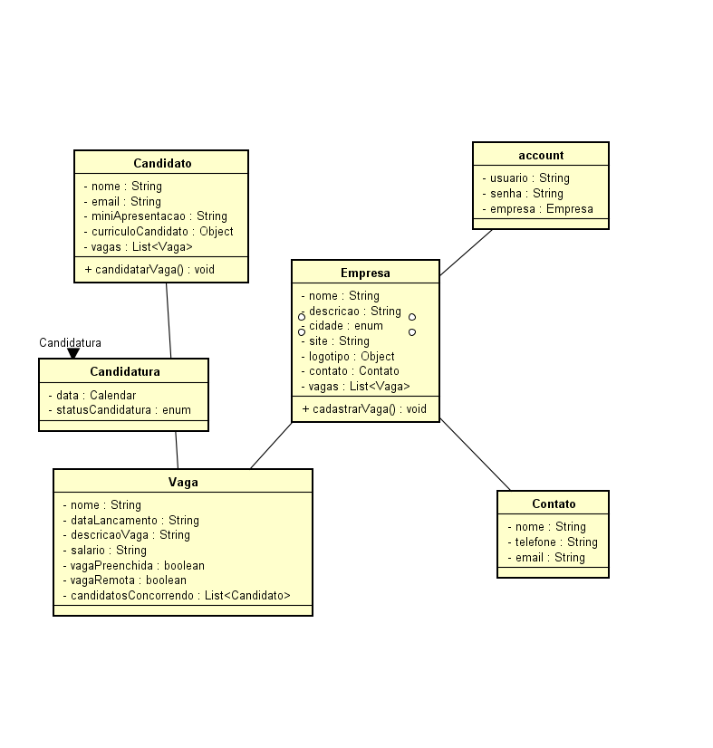


# jobs_app
Atividade C

#Componentes 
	Luiz Junior
	Guilherme Rodrigues
	Ermeson Sousa 
	Fabiano Santana
	Marcos Paulo
  #
# Descricao conceitual do  problema

                Empresa tem uma lista vagasDisponiveis(Vaga),
                        nomeEmpresa,descricaoEmpresa,siteEmpresa,cidade(enum),site,logotipo,tem um contato(Contato). 
                        E um Metodo
                        cadastrarVaga
                Account 
                    tem uma empresa(Empresa)
                    tem um usuario,tem uma senha;            
                Contato
                        tem nome,telefone,email;
                Candidatura
                        data,statusCandidatura;
                Vaga tem uma lista de candidatosConcorrendo(Candidato),
                         dataLançamentoVaga,descricaoVaga,nomeVaga,salarioVaga,
                         tem um metodo receberCandidato(Candidato),vagaPreenchida,vagaRemota.
                
                Candidato 
                        tem uma lista de vagas(Vaga) 
                        tem nomeCandidato,email,
                        miniApresentacao,curriculoCandidato
                        tem um metodo candidatarVaga
<<<<<<< HEAD
!{ScreenShot}(graficoAtt)
>>>>>>> 65a2a5ab158d7233174046fa5309fc17266fd8b5
=======

>>>>>>> 6c04fc6ec0f9f7f07c59a11c7871c5d56961049f
